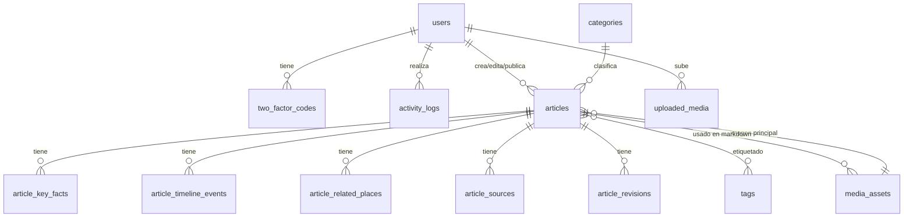
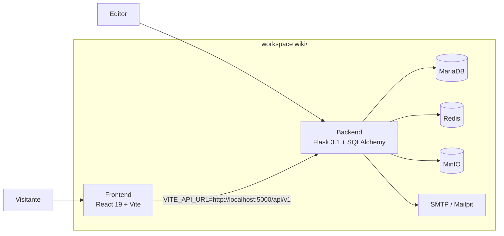
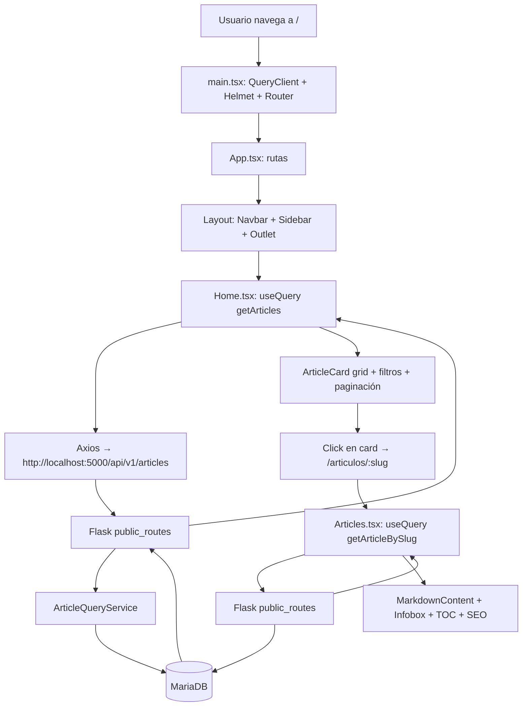
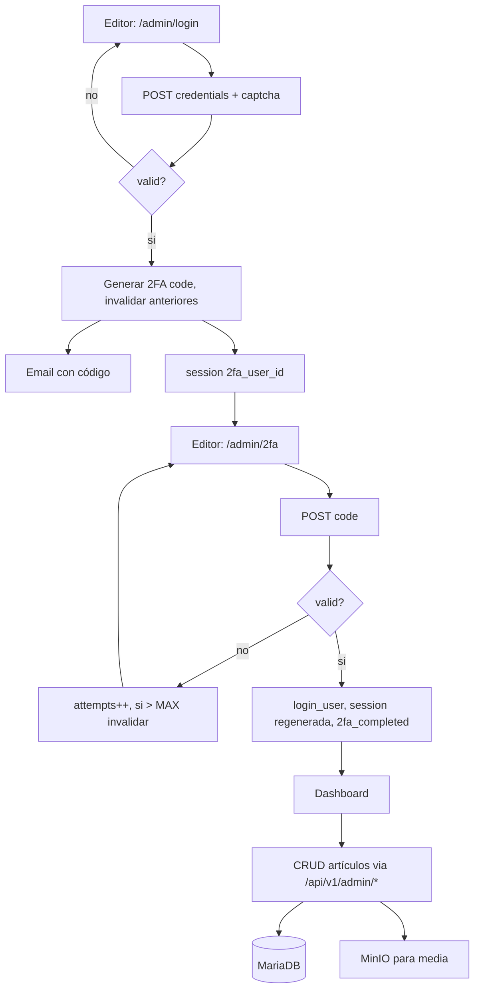
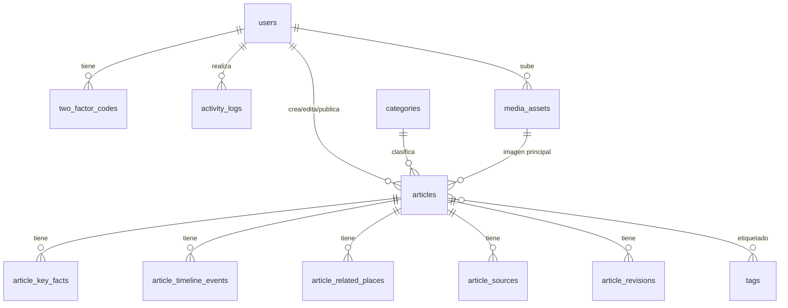

# WikiLavalleja — Arquitectura integrada

> Documento técnico descriptivo del workspace tras la integración frontend/backend. Refleja el código real, no estados intermedios.

---

## 1. Resumen ejecutivo

WikiLavalleja es ahora una plataforma completa de publicación enciclopédica con dos superficies integradas:

- **Frontend público** (React 19 + Vite + TypeScript + Tailwind 4 + DaisyUI) que consume exclusivamente la API Flask.
- **Backend Flask 3.1** que sirve simultáneamente la API pública JSON, una API administrativa JSON y un panel editorial server-rendered (Jinja2 + Tailwind).

Ambos proyectos viven en el mismo repositorio. El frontend está en `./` (`src/`, `public/`, `data/`), el backend en `./backend/` (`backend/app/`, `backend/migrations/`). El frontend apunta a `VITE_API_URL` (por defecto `http://localhost:5000/api/v1`). El backend sirve:

- API pública en `/api/v1/*` (paginada, buscable, filtrable).
- API administrativa en `/api/v1/admin/*` (CRUD completo con 2FA + CSRF).
- Panel editorial en `/admin/*` (Jinja2 + Tailwind).
- Healthchecks en `/health/live` y `/health/ready`.
- Métricas Prometheus en `/metrics`.
- Sitemap XML dinámico en `/api/v1/sitemap`.

La persistencia es **MariaDB** (datos), **Redis** (rate limit) y **MinIO** (media). La autenticación administrativa usa sesión Flask-Login con 2FA por correo. Los datos heredados de `data/db.json` se migran con `flask import-wiki-data`.

---

## 2. Mapa general

```
wiki/
├── backend/                          Flask backend completo
│   ├── app/
│   │   ├── models/                   Modelos SQLAlchemy 2
│   │   │   ├── user.py                User, TwoFactorCode
│   │   │   ├── audit.py               ActivityLog
│   │   │   ├── article.py             Article, ArticleKeyFact,
│   │   │   │                          ArticleTimelineEvent,
│   │   │   │                          ArticleRelatedPlace,
│   │   │   │                          ArticleSource, ArticleRevision
│   │   │   ├── category.py            Category
│   │   │   ├── tag.py                 Tag
│   │   │   └── media_asset.py         MediaAsset
│   │   ├── schemas/wiki_schemas.py    Esquemas Marshmallow (camelCase)
│   │   ├── services/                  Lógica de negocio
│   │   │   ├── article_service.py
│   │   │   ├── article_query_service.py
│   │   │   ├── publication_service.py
│   │   │   ├── revision_service.py
│   │   │   ├── media_service.py
│   │   │   ├── media_resolver.py
│   │   │   ├── taxonomy_service.py
│   │   │   ├── wiki_import_service.py
│   │   │   ├── minio_service.py
│   │   │   └── mail_service.py
│   │   ├── routes/
│   │   │   ├── admin/                 Blueprint admin Jinja2
│   │   │   └── api/                   Blueprints JSON API
│   │   │       ├── public_routes.py
│   │   │       └── admin_routes.py
│   │   ├── templates/                 Jinja2 (admin, emails, errors)
│   │   ├── commands.py                CLI (create-admin, import-wiki-data, ...)
│   │   ├── health.py                  /health/live, /health/ready
│   │   ├── metrics.py                 Prometheus
│   │   ├── error_handlers.py
│   │   ├── extensions.py
│   │   ├── config.py
│   │   └── __init__.py                Application factory
│   ├── migrations/versions/
│   │   ├── 0001_initial.py            users, two_factor_codes, activity_logs
│   │   └── 0002_wiki_content_domain.py  articles, categories, tags, media
│   ├── Dockerfile
│   ├── entrypoint.sh                  Migración + Gunicorn
│   ├── gunicorn.conf.py
│   ├── requirements.txt
│   ├── wsgi.py
│   ├── .env.example
│   └── README.md
├── src/                               Frontend React
│   ├── components/                    Layout, Navbar, ArticleCard, ArticleInfobox,
│   │                                   WikiSidebar, WikiToc, MarkdownContent,
│   │                                   SearchBox, ThemeToggle, ThemeInitializer
│   ├── pages/                         Home, Articles, NotFound
│   ├── lib/api.ts                     Cliente Axios + tipos
│   ├── lib/utils.ts                    slugify, extractToc
│   ├── types/article.ts                Interfaz Article
│   ├── stores/themeStore.ts            Zustand: tema light/dark
│   ├── styles/global.css               Tailwind + DaisyUI + CSS vars (wl-*)
│   ├── App.tsx                         Rutas
│   └── main.tsx                        QueryClientProvider + HelmetProvider + BrowserRouter
├── data/db.json                        Dataset legado (solo para migración)
├── public/                             Assets estáticos frontend
├── docker-compose.dev.yml               Dev: MariaDB, Redis, MinIO, Mailpit
├── Dockerfile                          Frontend (nginx)
├── nginx.conf
├── .env.example                        Frontend env vars
├── README.md
├── infraesructura.md                   Este documento
└── IMPLEMENTATION_REPORT.md            Detalle de cambios
```

---

## 3. Estado de integración

- **Estado**: **Integrado**.
- **Frontend consume API real**: `src/lib/api.ts` apunta a `VITE_API_URL || "http://localhost:5000/api/v1"`.
- **JSON Server eliminado**: package.json no incluye `json-server` ni el script `server`.
- **Backend sirve API pública y administrativa**: 30+ endpoints en `/api/v1/`.
- **Panel editorial server-rendered**: Login, 2FA, dashboard, artículos, multimedia, usuarios, auditoría.
- **Datos migrados**: `data/db.json` se importa con `flask import-wiki-data`.
- **Media en MinIO**: pipeline completo de upload, procesamiento, variantes, serving.

---

## 4. Arquitectura del frontend

### 4.1 Propósito

Portal enciclopédico para visitantes. Lee y filtra artículos de la API Flask, renderiza Markdown con tabla de contenidos, soporta modo claro/oscuro persistente y SEO completo.

### 4.2 Tecnologías

| Categoría | Tecnología | Versión |
|---|---|---|
| Framework | React | 19.2.7 |
| Lenguaje | TypeScript | 6.0.2 |
| Build | Vite | 8.1.1 |
| Estilos | TailwindCSS | 4.3.2 |
| Componentes | DaisyUI | 5.6.13 |
| Tipografía | @tailwindcss/typography | 0.5.20 |
| Router | react-router-dom | 7.18.1 |
| Estado servidor | @tanstack/react-query | 5.101.2 |
| HTTP | axios | 1.18.1 |
| Estado global | zustand | 5.0.14 (tema) |
| Markdown | react-markdown | 10.1.0 |
| Markdown GFM | remark-gfm | 4.0.1 |
| SEO | react-helmet-async | 3.0.0 |

### 4.3 Rutas

| Ruta | Archivo | Descripción |
|---|---|---|
| `/` | `src/pages/Home.tsx` | Listado, búsqueda, filtros, paginación |
| `/articulos/:slug` | `src/pages/Articles.tsx` | Detalle con SEO, infobox, TOC |
| `*` | `src/pages/NotFound.tsx` | 404 |

### 4.4 Consumo de API

Todas las llamadas pasan por `src/lib/api.ts` (Axios + tipos). Funciones principales:

- `getArticles(params)` — `GET /api/v1/articles`
- `getArticleBySlug(slug)` — `GET /api/v1/articles/<slug>`
- `getCategories()` — `GET /api/v1/categories`
- `getTags()` — `GET /api/v1/tags`
- `resolveMediaUrl(path)` — convierte `/api/v1/media/...` a URL absoluta

TanStack Query cachea, deduplica, y reintenta. La búsqueda usa debounce de 300ms. La paginación se refleja en la query string (`?page=2`).

### 4.5 Tema (light/dark)

Zustand store (`src/stores/themeStore.ts`) maneja `theme: "light" | "dark"`. Al montar, `ThemeInitializer` lee `localStorage["wikilavalleja-theme"]` o `prefers-color-scheme`. Aplica `data-theme` y clase `dark` al `<html>`. CSS variables (`:root` y `html.dark`) controlan `wl-bg`, `wl-surface`, `wl-text`, etc. que todos los componentes consumen.

### 4.6 SEO

`react-helmet-async` provee `<Helmet>` por página. Articles.tsx incluye:

- `<title>` dinámico
- `<meta name="description">`
- `<link rel="canonical">`
- Open Graph (`og:title`, `og:description`, `og:image`, `og:type`)
- Twitter Card (`twitter:card`)

`/public/robots.txt` apunta al sitemap. El sitemap se sirve dinámicamente desde `/api/v1/sitemap`.

---

## 5. Arquitectura del backend

### 5.1 Propósito

Backend Flask 3.1 que sirve API pública + API administrativa + panel editorial para WikiLavalleja. Modela el dominio enciclopédico completo: artículos, categorías, etiquetas, multimedia, revisiones, auditoría.

### 5.2 Tecnologías

| Categoría | Tecnología | Versión |
|---|---|---|
| Framework | Flask | 3.1.2 |
| ORM | SQLAlchemy + Flask-SQLAlchemy | 2.0.46 / 3.1.1 |
| Migraciones | Flask-Migrate (Alembic) | 4.1.0 |
| DB drivers | mariadb | 1.1.14 |
| Auth | Flask-Login | 0.6.3 |
| Hashing | argon2-cffi | 25.1.0 |
| Formularios | Flask-WTF / WTForms | 1.2.2 / 3.2.1 |
| CSRF | Flask-WTF (CSRFProtect) | 1.2.2 |
| Cache/Rate limit | Redis + Flask-Limiter | 7.2.0 / 4.1.1 |
| CORS | flask-cors | 6.0.2 |
| Headers seguridad | flask-talisman | 1.1.0 |
| Mail | Flask-Mail | 0.10.0 |
| Storage | minio | 7.2.20 |
| Procesamiento imagen | Pillow | 11.2.1 |
| Serialización | marshmallow + flask-marshmallow | 4.2.1 / 1.3.0 |
| Métricas | prometheus-client | 0.21.1 |
| Templates | Jinja2 | 3.1.6 |
| Servidor WSGI | Gunicorn | 24.1.1 |
| HTTP client | requests | 2.32.3 |
| Sanitización | bleach | 6.3.0 |
| Test (no usados) | pytest | (no instalado aún) |

### 5.3 Patrón arquitectónico

- **Application Factory** en `app/__init__.py:create_app(config_name)`.
- **Blueprints**:
  - `health_bp` (`/health`, `/health/live`, `/health/ready`)
  - `api_bp` (`/api/v1/*` — API pública)
  - `admin_api_bp` (`/api/v1/admin/*` — API administrativa JSON)
  - `admin_bp` (`/admin/*` — panel editorial Jinja2)
- **Extensiones no ligadas** en `app/extensions.py`.
- **Modelos** en `app/models/`.
- **Esquemas Marshmallow** en `app/schemas/wiki_schemas.py` (camelCase).
- **Servicios** en `app/services/` con responsabilidades claras.
- **Formularios** en `app/forms/` (WTForms).
- **CLI Commands** en `app/commands.py`.
- **Error Handlers** globales en `app/error_handlers.py`.
- **Logging** centralizado en `app/utils/logging_helper.py:log_activity()`.
- **Configuración por entorno**: `development`, `production`, `testing`.
- **ProxyFix** configurado para Coolify (1 hop).

### 5.4 Endpoints

#### API pública (`/api/v1/`, CSRF-exempt, sin credenciales CORS)

| Método | Ruta | Auth | Descripción |
|---|---|---|---|
| GET | `/api/v1/articles` | No | Listado paginado, búsqueda, filtros |
| GET | `/api/v1/articles/<slug>` | No | Detalle completo |
| GET | `/api/v1/categories` | No | Categorías activas |
| GET | `/api/v1/tags` | No | Etiquetas en uso |
| GET | `/api/v1/media/<uuid>/content/<variant>` | No | Contenido multimedia |
| GET | `/api/v1/sitemap` | No | Sitemap XML dinámico |

#### API administrativa (`/api/v1/admin/`, sesión + 2FA + CSRF)

| Método | Ruta | Rol | Descripción |
|---|---|---|---|
| GET/POST | `/api/v1/admin/articles` | Admin | Listar/crear |
| GET/PATCH/DELETE | `/api/v1/admin/articles/<id>` | Admin | CRUD individual |
| POST | `/api/v1/admin/articles/<id>/publish` | Super | Publicar |
| POST | `/api/v1/admin/articles/<id>/unpublish` | Super | Retirar publicación |
| POST | `/api/v1/admin/articles/<id>/archive` | Super | Archivar |
| POST | `/api/v1/admin/articles/<id>/restore` | Admin | Restaurar |
| POST | `/api/v1/admin/articles/<id>/duplicate` | Admin | Duplicar |
| GET | `/api/v1/admin/articles/<id>/revisions` | Admin | Historial |
| POST | `/api/v1/admin/articles/<id>/revisions/<rev>/restore` | Super | Restaurar revisión |
| POST | `/api/v1/admin/articles/<id>/autosave` | Admin | Autoguardado |
| GET/POST | `/api/v1/admin/categories` | Super | CRUD |
| GET/POST | `/api/v1/admin/tags` | Admin | CRUD |
| GET/POST | `/api/v1/admin/media` | Admin | Listar/subir |
| GET/PATCH/DELETE | `/api/v1/admin/media/<uuid>` | Admin/Super | Gestión |
| GET | `/api/v1/admin/media/<uuid>/usage` | Admin | Verificar uso |

#### Panel admin (`/admin/`)

| Ruta | Auth | Descripción |
|---|---|---|
| GET/POST `/admin/login` | No | Login con captcha |
| GET/POST `/admin/2fa` | 2FA session | Verificación código |
| POST `/admin/logout` | Login | Logout con CSRF |
| GET `/admin/dashboard` | Login | Métricas y actividad reciente |
| GET `/admin/articles` | Login | Listado de artículos |
| GET `/admin/articles/new` | Login | Nuevo artículo |
| GET `/admin/articles/<id>/edit` | Login | Editor de artículo |
| GET `/admin/articles/<id>/revisions` | Login | Historial de revisiones |
| GET `/admin/media` | Login | Biblioteca multimedia |
| GET `/admin/users` | Super | Gestión de usuarios |
| GET `/admin/logs` | Super | Auditoría |

#### Health, metrics, static

| Método | Ruta | Descripción |
|---|---|---|
| GET | `/health/live` | Liveness probe |
| GET | `/health/ready` | Readiness probe (DB, Redis, MinIO) |
| GET | `/health` | Legacy healthcheck |
| GET | `/metrics` | Prometheus metrics |
| GET | `/public/<filename>` | Archivos estáticos desde `backend/public/` |

### 5.5 Modelos y base de datos

#### Resumen

| Modelo | Tabla | Archivo | Campos principales |
|---|---|---|---|
| `User` | `users` | `user.py` | id, username, email, password_hash, is_active, is_superuser, created_at, last_login_at |
| `TwoFactorCode` | `two_factor_codes` | `user.py` | id, user_id, code_hash, expires_at, attempts, consumed_at, created_at |
| `ActivityLog` | `activity_logs` | `audit.py` | id, user_id, username, action, details, ip_address, user_agent, created_at |
| `Category` | `categories` | `category.py` | id, name, slug, description, sort_order, is_active, created_at, updated_at |
| `Tag` | `tags` | `tag.py` | id, name, slug, created_at, updated_at |
| `Article` | `articles` | `article.py` | id, slug, title, subtitle, type, street_name, period, birth_place, death_place, category_id, summary, hero_media_id, image_alt, image_credit, latitude, longitude, coordinate_confidence, coordinate_note, street_evidence_status, street_evidence_note, historical_context, source_notes, body_markdown, status, featured, seo_title, seo_description, canonical_url, created_by_id, updated_by_id, published_by_id, created_at, updated_at, published_at, archived_at, deleted_at, version |
| `ArticleKeyFact` | `article_key_facts` | `article.py` | id, article_id, text, position |
| `ArticleTimelineEvent` | `article_timeline_events` | `article.py` | id, article_id, year, event, position |
| `ArticleRelatedPlace` | `article_related_places` | `article.py` | id, article_id, name, description, type, position |
| `ArticleSource` | `article_sources` | `article.py` | id, article_id, label, url, kind, position, accessed_at |
| `ArticleRevision` | `article_revisions` | `article.py` | id, article_id, revision_number, snapshot_json, created_by_id, created_at, reason |
| `article_tags` | `article_tags` | `article.py` | article_id, tag_id (many-to-many) |
| `MediaAsset` | `media_assets` | `media_asset.py` | id, uuid, original_filename, object_name, mime_type, extension, size_bytes, width, height, checksum_sha256, [small/medium/large/original]_object, [small/medium/large]_width/height, alt_text, caption, credit, license, source_url, is_public, uploaded_by_id, created_at, updated_at, deleted_at |

#### Índices

- `articles.slug` (único)
- `articles.status`, `articles.published_at`, `articles.updated_at`, `articles.category_id`, `articles.featured`, `articles.deleted_at`
- `articles.status + published_at` (compuesto)
- `categories.slug` (único)
- `tags.slug` (único)
- `media_assets.uuid` (único), `media_assets.checksum_sha256`
- `article_key_facts.article_id`, `article_timeline_events.article_id`, `article_related_places.article_id`, `article_sources.article_id`, `article_revisions.article_id`

#### Diagrama ER



### 5.6 Autenticación

#### Flujo de login

1. `GET /admin/login` genera captcha matemático, guarda resultado en `session['captcha_result']`.
2. `POST /admin/login` valida captcha, busca usuario por email, valida contraseña con Argon2.
3. Si OK: invalida códigos 2FA anteriores no consumidos, genera código 6 dígitos, hashea con Argon2, guarda en `TwoFactorCode`, envía por correo.
4. Solo si `ENABLE_2FA_CODE_LOGGING=True`, el código se loguea a stdout (desactivado por defecto).
5. `session['2fa_user_id'] = user.id`, redirige a `/admin/2fa`.

#### Flujo de 2FA

1. `POST /admin/2fa` busca el código más reciente no consumido del usuario.
2. Incrementa `attempts` en cada intento.
3. Si `attempts > MAX_2FA_ATTEMPTS` (default 5): invalida el código, pide uno nuevo.
4. Si válido: marca `consumed_at`, `login_user(user)`, regenera sesión (anti session fixation), `session['2fa_completed'] = True`, redirige a dashboard.

#### Logout

- `POST /admin/logout` con CSRF: `logout_user()`, `session.clear()`.

### 5.7 Seguridad del 2FA (mejoras aplicadas)

- Códigos anteriores no consumidos se invalidan al crear uno nuevo.
- `attempts` se incrementa en cada intento fallido.
- Después de `MAX_2FA_ATTEMPTS`, el código se invalida.
- Códigos NO se loguean a stdout por defecto. Activable con `ENABLE_2FA_CODE_LOGGING=True`.
- Sesión regenerada al completar 2FA.
- Cookies `HttpOnly`, `SameSite=Lax`, `Secure` en producción.

### 5.8 Roles y permisos

| Rol | Permisos |
|---|---|
| Usuario inactivo | Bloqueado en login |
| Admin (no super) | Login, dashboard, crear/editar artículos, subir media, ver revisiones |
| Super Admin | Todo lo anterior + gestionar usuarios, publicar, archivar, restaurar, forzar borrados, ver auditoría completa |

`require_superuser()` se aplica en rutas admin. `User.is_superuser` es el flag.

### 5.9 Manejo de errores

Formato JSON consistente:

```json
{
  "error": {
    "code": "NOT_FOUND",
    "message": "Recurso no encontrado.",
    "details": null,
    "requestId": "uuid"
  }
}
```

Códigos HTTP: 200, 201, 204, 400, 401, 403, 404, 409, 413, 415, 422, 429, 500, 503.

Stack traces nunca expuestos en producción. `X-Request-ID` siempre presente.

### 5.10 Servicios de infraestructura

| Servicio | Propósito | Config | Obligatorio |
|---|---|---|---|
| MariaDB | Datos | `DATABASE_URL` | Sí |
| Redis | Rate limit | `REDIS_URL` | No (con fallback memory) |
| MinIO | Media | `MINIO_*` | Recomendado |
| SMTP | 2FA emails | `MAIL_*` | Sí para 2FA funcional |
| Prometheus | Métricas | `PROMETHEUS_MULTIPROC_DIR` | No |

### 5.11 Variables de entorno

30+ variables documentadas en `backend/.env.example`. Las clave:

- `SECRET_KEY` (obligatoria)
- `DATABASE_URL`
- `REDIS_URL`
- `MINIO_*` (endpoint, keys, bucket)
- `MAIL_*` (server, port, credentials)
- `CORS_ORIGINS`
- `FLASK_CONFIG`
- `APP_BASE_URL`, `FRONTEND_URL`
- `WIKI_MEDIA_MAX_BYTES`, `WIKI_MEDIA_*_WIDTH`
- `ENABLE_2FA_CODE_LOGGING`, `MAX_2FA_ATTEMPTS`
- `SESSION_LIFETIME_MINUTES`
- `OPENAPI_ENABLED`

---

## 6. Importación de datos

`flask import-wiki-data <path>` lee `data/db.json`:

1. Lee y valida el JSON.
2. Detecta artículos por slug.
3. Crea o reutiliza categorías (por nombre).
4. Crea o reutiliza tags (por slug).
5. Crea el artículo con sus hijos (key facts, timeline, places, sources).
6. Conserva coordenadas, evidencia de calle, metadatos de imagen.
7. Aplica validaciones (URLs SSRF-safe, tipos de fuente permitidos).
8. Opciones:
   - `--dry-run` — simular
   - `--update-existing` — actualizar
   - `--publish` — publicar si válido
   - `--continue-on-error` — continuar ante errores
   - `--download-images` — descargar imágenes externas a MinIO (no implementado aún)

Salida: contadores de leídos, creados, actualizados, omitidos, errores, imágenes importadas.

---

## 7. Diagramas

### 7.1 Workspace



### 7.2 Flujo del frontend



### 7.3 Flujo del editor



### 7.4 Entidades (backend)



---

## 8. Hallazgos y limitaciones

### 8.1 Implementado

- Modelos completos del dominio wiki con FKs e índices.
- Migración nueva (`0002_wiki_content_domain`) sin tocar la inicial.
- Esquemas Marshmallow con camelCase.
- Servicios con responsabilidades separadas.
- API pública paginada, buscable, filtrable, ordenable.
- API administrativa con control de concurrencia (`version`).
- Panel editorial server-rendered con editor completo (identidad, ficha, contenido, hechos, cronología, lugares, fuentes, imagen, publicación).
- Biblioteca multimedia con upload drag-and-drop y variantes.
- Pipeline de imágenes con Pillow (verificación de tipo real, EXIF, WebP, variantes, SHA-256).
- Comando de importación idempotente con validación SSRF.
- 2FA con invalidación de códigos anteriores, control de intentos, no log a stdout.
- Logout POST con CSRF.
- CORS limitado a API pública.
- CSRF exento para API, requerido para admin API.
- ProxyFix para Coolify.
- Healthchecks `/health/live` y `/health/ready`.
- Sitemap XML dinámico.
- Frontend integrado con API Flask.
- Búsqueda con debounce 300ms.
- Paginación con query string.
- Categorías dinámicas.
- SEO completo (title, description, canonical, OG, Twitter).
- Tema claro/oscuro con Zustand.
- JSON Server eliminado del frontend.
- Dockerfile para frontend con nginx.
- docker-compose.dev.yml para servicios de desarrollo.
- Documentación actualizada (README raíz, backend README, Instructions.txt, IMPLEMENTATION_REPORT.md).

### 8.2 Pendiente (no implementado)

- **Editor Markdown avanzado** (EasyMDE) en el panel administrativo — actualmente usa un textarea simple.
- **Descarga de imágenes remotas** durante `--download-images` — el flag existe pero no descarga.
- **Pruebas automatizadas**: pytest (backend), Vitest + React Testing Library + MSW (frontend), Playwright E2E.
- **OpenAPI/Swagger UI** documentando los endpoints.
- **Coolify docker-compose** integrado para deploy completo de un solo comando.
- **Verificación real de la importación de datos** — el comando está implementado pero no fue ejecutado en una base de datos real para confirmar la salida.
- **Open Graph en Home.tsx** — solo Articles.tsx tiene SEO completo.
- **Tests de seguridad** que verifiquen que el 2FA bloquea después de MAX_2FA_ATTEMPTS.

### 8.3 Riesgos conocidos

- El comando `flask import-wiki-data` no fue ejecutado en una base de datos real durante la implementación. La lógica está probada solo por inspección de código.
- El editor de artículos en el panel admin usa fetch() directamente sin manejo robusto de race conditions más allá del control de versión.
- El frontend tiene un bundle JS > 500KB (sin code splitting). Aceptable para un MVP pero mejorable.

---

## 9. Despliegue

### Frontend

```bash
docker build -t wikilavalleja-frontend .
# Sirve dist/ con nginx en puerto 80
# Variables: VITE_API_URL
```

### Backend

```bash
cd backend
docker build -t wikilavalleja-backend .
# Expone 5000. entrypoint.sh ejecuta migrations y luego Gunicorn.
```

### Servicios

```bash
docker compose -f docker-compose.dev.yml up -d
# MariaDB, Redis, MinIO, Mailpit
```

### Orden de deploy

1. MariaDB, Redis, MinIO (servicios).
2. Backend (Docker en Coolify). Crear admin e importar datos.
3. Frontend (Docker en Coolify). Apuntar `VITE_API_URL` al backend público.

---

## 10. Conclusión

WikiLavalleja está integrado como una plataforma completa de publicación enciclopédica. El frontend React consume exclusivamente la API Flask; el backend Flask sirve API + panel editorial + healthchecks; los datos se migran desde `data/db.json`; las imágenes se procesan y almacenan en MinIO; el tema claro/oscuro funciona globalmente; la seguridad del 2FA está endurecida; la persistencia, migraciones, SEO y documentación están completas.

El sistema es ejecutable hoy mismo, asumiendo la existencia de MariaDB, Redis y MinIO. Los pendientes identificados (pruebas automatizadas, EasyMDE, descarga de imágenes en importación, OpenAPI UI) son evoluciones incrementales que no bloquean el uso del sistema.
